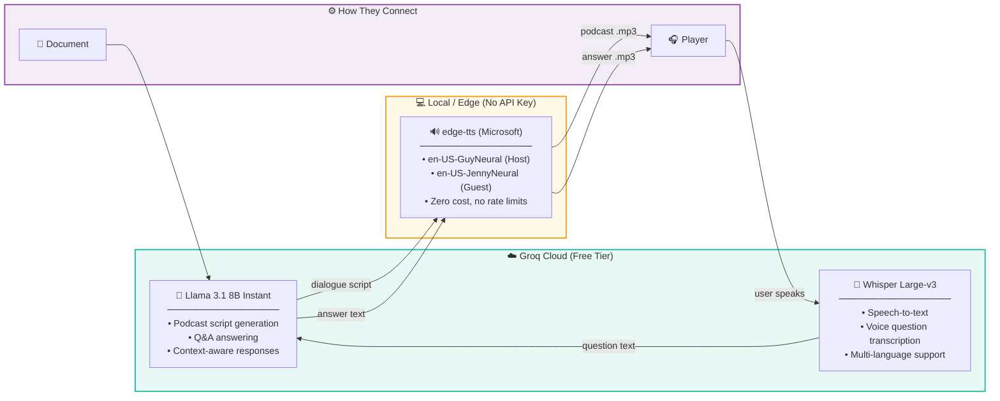

# 🎧 PaperPod

**Doc to podcast-style conversation audio book + real-time Q&A support**

Upload any document (PDF, DOCX, TXT) → AI generates a natural two-host podcast conversation → Listen & ask real-time questions with voice.

---

## Tech Stack

| Layer | Technology |
|-------|-----------|
| **Frontend** | React 18 + Vite + Tailwind CSS |
| **Backend** | FastAPI (Python) |
| **LLM** | Llama 3.1 via Groq (free tier) |
| **TTS** | edge-tts (Microsoft, free, no API key) |
| **STT** | Whisper large-v3 via Groq (free tier) |
| **Retrieval** | Lightweight in-memory keyword search (demo) |
| **Database** | SQLite (via SQLAlchemy async) |

## Quick Start

### Prerequisites
- Python 3.10+
- Node.js 18+
- ffmpeg (`brew install ffmpeg` on macOS)

### 1. Backend

```bash
cd backend
cp .env.example .env
# Edit .env → add your GROQ_API_KEY (free from https://console.groq.com)

python -m venv venv
source venv/bin/activate
pip install -r requirements.txt

uvicorn app.main:app --reload --port 8000
```

### 2. Frontend

```bash
cd frontend
npm install
npm run dev
```

Open **http://localhost:5173** — upload a document and enjoy your podcast!

## Project Structure

```
PaperPod/
├── backend/
│   ├── .env.example              # Environment config (copy to .env)
│   ├── requirements.txt           # Python dependencies
│   └── app/
│       ├── main.py               # FastAPI entry point
│       ├── config.py             # Settings & configuration
│       ├── database.py           # SQLAlchemy models (documents ↔ audio_files 1:1)
│       ├── routes/
│       │   ├── documents.py      # Upload, list, status endpoints
│       │   ├── audio.py          # Stream podcast MP3
│       │   └── qa.py             # Q&A: voice/text question → audio answer
│       └── services/
│           ├── document_service.py   # PDF/DOCX/TXT extraction + chunking
│           ├── vector_service.py     # In-memory chunk store + keyword retrieval
│           ├── llm_service.py        # Groq Llama 3 (podcast script + Q&A)
│           ├── tts_service.py        # edge-tts (Host=male, Guest=female voices)
│           └── stt_service.py        # Whisper speech-to-text
├── frontend/
│   ├── src/
│   │   ├── App.jsx               # Main app (upload → processing → player)
│   │   ├── api.js                # API client (axios)
│   │   ├── components/
│   │   │   ├── UploadZone.jsx    # Drag-n-drop file upload
│   │   │   ├── PodcastPlayer.jsx # Audio player + transcript view
│   │   │   └── QAPanel.jsx       # Voice/text Q&A chat interface
│   │   └── hooks/
│   │       └── useAudioRecorder.js  # MediaRecorder hook for mic input
│   ├── index.html
│   ├── package.json
│   ├── vite.config.js
│   ├── tailwind.config.js
│   └── postcss.config.js
├── paperPodDocs/
│   ├── diagrams.md               # Mermaid diagrams for investor decks
│   └── ...                      # Your existing docs & images
├── .gitignore
└── README.md
```

## Architecture

See `paperPodDocs/diagrams.md` for full Mermaid diagrams (paste into https://mermaid.live).

## AI Models



| Model | Provider | Purpose | Cost |
|-------|----------|---------|------|
| **Llama 3.1 8B Instant** | Groq | Podcast script generation + Q&A | Free (rate-limited) |
| **Whisper Large-v3** | Groq | Speech-to-text (voice questions) | Free (rate-limited) |
| **edge-tts GuyNeural** | Microsoft Edge | TTS — Host voice (male) | Free, no API key |
| **edge-tts JennyNeural** | Microsoft Edge | TTS — Guest voice (female) | Free, no API key |

## API Endpoints

| Method | Endpoint | Description |
|--------|----------|-------------|
| `POST` | `/api/documents/upload` | Upload document, starts podcast generation |
| `GET` | `/api/documents/{doc_id}` | Get document + audio status |
| `GET` | `/api/documents/` | List all documents |
| `GET` | `/api/audio/{audio_id}` | Stream podcast audio |
| `POST` | `/api/qa/ask` | Ask question (text or voice) |
| `GET` | `/api/qa/audio/{qa_id}` | Get Q&A answer audio |
| `GET` | `/api/qa/history/{doc_id}` | Q&A history for a document |
