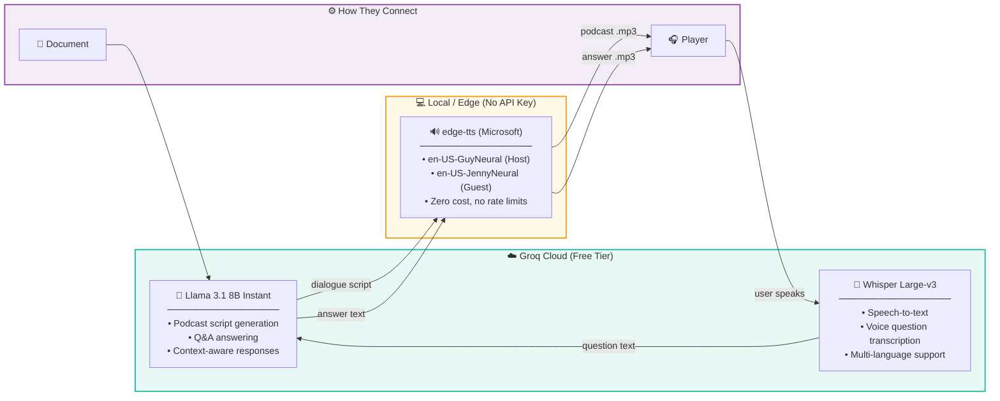

# 🎧 PaperPod

**Documents → Podcast-style conversations → Real-time voice Q&A**

Upload any document (PDF, DOCX, TXT) → AI generates a natural two-host podcast conversation → Listen & ask real-time questions with voice.

[](#demo)
[](#license)

---

## ✨ Features

- **Document to Podcast** — Upload a PDF/DOCX/TXT and get an engaging two-host podcast conversation
- **Dual AI Voices** — Male host + female guest with natural speech synthesis
- **Real-time Q&A** — Ask questions about the document via voice or text, get audio answers
- **No GPU Required** — Runs entirely on CPU using cloud AI APIs (free tier)
- **Privacy First** — Documents stay on your machine; only text is sent to LLM API

---

## Tech Stack

| Layer | Technology |
|-------|-----------|
| **Frontend** | React 18 + Vite + Tailwind CSS |
| **Backend** | FastAPI (Python 3.10+) |
| **LLM** | Llama 3.1 8B via Groq (free tier) |
| **TTS** | edge-tts (Microsoft, free, no API key) |
| **STT** | Whisper Large-v3 via Groq (free tier) |
| **Retrieval** | In-memory keyword search (demo) |
| **Database** | SQLite (via SQLAlchemy async) |

---

## 🚀 Quick Start — Local Setup

### Prerequisites

| Tool | Version | Install |
|------|---------|---------|
| **Python** | 3.10 or higher | [python.org](https://www.python.org/downloads/) or `brew install python` |
| **Node.js** | 18 or higher | [nodejs.org](https://nodejs.org/) or `brew install node` |
| **ffmpeg** | any | `brew install ffmpeg` (macOS) / `sudo apt install ffmpeg` (Ubuntu) / [ffmpeg.org](https://ffmpeg.org/download.html) (Windows) |
| **Git** | any | `brew install git` or [git-scm.com](https://git-scm.com/) |

### Step 1: Get a free Groq API key

1. Go to [console.groq.com](https://console.groq.com)
2. Sign up (free — no credit card needed)
3. Create an API key and copy it

### Step 2: Clone the repo

```bash
git clone https://github.com/pushkal1234/PaperPod.git
cd PaperPod
```

### Step 3: Set up the Backend

```bash
cd backend

# Copy the example env file and add your Groq API key
cp .env.example .env
# Open .env in any editor and replace 'gsk_your_key_here' with your actual key
# Example: GROQ_API_KEY=gsk_abc123...

# Create a Python virtual environment
python3 -m venv venv

# Activate the virtual environment
source venv/bin/activate        # macOS / Linux
# venv\Scripts\activate         # Windows (Command Prompt)
# venv\Scripts\Activate.ps1     # Windows (PowerShell)

# Upgrade pip (recommended)
pip install --upgrade pip setuptools wheel

# Install dependencies
pip install -r requirements.txt

# Start the backend server
uvicorn app.main:app --reload --port 8000
```

You should see: `INFO: Application startup complete.`

### Step 4: Set up the Frontend (new terminal)

```bash
# Open a new terminal tab/window, navigate to the project
cd PaperPod/frontend

# Install Node.js dependencies
npm install

# Start the development server
npm run dev
```

You should see: `Local: http://localhost:5173/`

### Step 5: Use PaperPod

1. Open **http://localhost:5173** in your browser
2. Upload a PDF, DOCX, or TXT document
3. Wait ~2-3 minutes for podcast generation
4. Listen to your AI-generated podcast
5. Ask questions via voice or text in the Q&A panel

---

## ⚠️ Troubleshooting

| Problem | Solution |
|---------|----------|
| `pip install` fails with `pkg_resources` error | Run `pip install --upgrade pip setuptools wheel` first |
| Backend: `No module named 'greenlet'` | Run `pip install greenlet` |
| Backend: `Address already in use` on port 8000 | Run `lsof -ti:8000 \| xargs kill -9` then restart |
| edge-tts gives 403 error | Run `pip install --upgrade edge-tts` |
| Groq API returns 413 (too large) | Normal for large docs — the app auto-chunks and retries |
| Frontend: blank page | Make sure backend is running on port 8000 first |
| `ffmpeg not found` | Install ffmpeg: `brew install ffmpeg` (macOS) |

## Project Structure

```
PaperPod/
├── backend/
│   ├── .env.example              # Environment config (copy to .env)
│   ├── requirements.txt           # Python dependencies
│   └── app/
│       ├── main.py               # FastAPI entry point
│       ├── config.py             # Settings & configuration
│       ├── database.py           # SQLAlchemy models (documents ↔ audio_files 1:1)
│       ├── routes/
│       │   ├── documents.py      # Upload, list, status endpoints
│       │   ├── audio.py          # Stream podcast MP3
│       │   └── qa.py             # Q&A: voice/text question → audio answer
│       └── services/
│           ├── document_service.py   # PDF/DOCX/TXT extraction + chunking
│           ├── vector_service.py     # In-memory chunk store + keyword retrieval
│           ├── llm_service.py        # Groq Llama 3 (podcast script + Q&A)
│           ├── tts_service.py        # edge-tts (Host=male, Guest=female voices)
│           └── stt_service.py        # Whisper speech-to-text
├── frontend/
│   ├── src/
│   │   ├── App.jsx               # Main app (upload → processing → player)
│   │   ├── api.js                # API client (axios)
│   │   ├── components/
│   │   │   ├── UploadZone.jsx    # Drag-n-drop file upload
│   │   │   ├── PodcastPlayer.jsx # Audio player + transcript view
│   │   │   └── QAPanel.jsx       # Voice/text Q&A chat interface
│   │   └── hooks/
│   │       └── useAudioRecorder.js  # MediaRecorder hook for mic input
│   ├── index.html
│   ├── package.json
│   ├── vite.config.js
│   ├── tailwind.config.js
│   └── postcss.config.js
├── .gitignore
└── README.md
```

## AI Models & Architecture



| Model | Provider | Purpose | Cost |
|-------|----------|---------|------|
| **Llama 3.1 8B Instant** | Groq | Podcast script generation + Q&A | Free (rate-limited) |
| **Whisper Large-v3** | Groq | Speech-to-text (voice questions) | Free (rate-limited) |
| **edge-tts GuyNeural** | Microsoft Edge | TTS — Host voice (male) | Free, no API key |
| **edge-tts JennyNeural** | Microsoft Edge | TTS — Guest voice (female) | Free, no API key |

## API Endpoints

| Method | Endpoint | Description |
|--------|----------|-------------|
| `POST` | `/api/documents/upload` | Upload document, starts podcast generation |
| `GET` | `/api/documents/{doc_id}` | Get document + audio status |
| `GET` | `/api/documents/list` | List all documents |
| `GET` | `/api/audio/{audio_id}` | Stream podcast audio |
| `POST` | `/api/qa/ask` | Ask question (text or voice) |
| `GET` | `/api/qa/audio/{qa_id}` | Get Q&A answer audio |
| `GET` | `/api/qa/history/{doc_id}` | Q&A history for a document |
