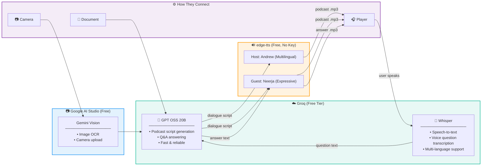

# 🎧 PaperPod

**Documents → Podcast-style conversations → Real-time voice Q&A**

Upload any document (PDF, DOCX, TXT) → AI generates a natural two-host podcast conversation → Listen & ask real-time questions with voice.

[](#demo)
[](#license)

---

## ✨ Features

- **Document to Podcast** — Upload a PDF/DOCX/TXT, paste text, or snap a photo and get an engaging two-host podcast conversation
- **Dual AI Voices** — Host + Guest with natural speech synthesis
- **Real-time Q&A** — Ask questions via voice or text, get audio answers
- **No GPU Required** — Runs entirely on CPU using cloud AI APIs (free tier)
- **Privacy First** — Documents stay on your machine; only text is sent to LLM API

---

## Tech Stack

| Layer | Technology |
|-------|-----------|
| **Frontend** | React 18 + Vite + Tailwind CSS |
| **Backend** | FastAPI (Python 3.10+) |
| **LLM** | Groq GPT OSS 20B (primary) + Google Gemini 2.5 Flash (large-doc summarization & fallback) |
| **STT** | Groq Whisper |
| **TTS** | edge-tts v7.2+ |
| **Vision / OCR** | Google Gemini Vision (image OCR + PDF figure description) |
| **Retrieval** | In-memory keyword search |
| **Database** | SQLite (local) / PostgreSQL (production) — SQLAlchemy async |

---

## 🚀 Quick Start — Local Setup

### Prerequisites

| Tool | Version | Install |
|------|---------|---------|
| **Python** | 3.10 or higher | [python.org](https://www.python.org/downloads/) or `brew install python` |
| **Node.js** | 18 or higher | [nodejs.org](https://nodejs.org/) or `brew install node` |
| **ffmpeg** | any | `brew install ffmpeg` (macOS) / `sudo apt install ffmpeg` (Ubuntu) / [ffmpeg.org](https://ffmpeg.org/download.html) (Windows) |
| **Git** | any | `brew install git` or [git-scm.com](https://git-scm.com/) |

### Step 1: Get free API keys

**Groq** (for LLM + STT):
1. Go to [console.groq.com/keys](https://console.groq.com/keys)
2. Sign up (free — no credit card needed)
3. Create an API key and copy it

**Google AI Studio** (for Image OCR only):
1. Go to [aistudio.google.com/app/apikey](https://aistudio.google.com/app/apikey)
2. Sign in with your Google account (free — no credit card needed)
3. Create an API key and copy it

### Step 2: Clone the repo

```bash
git clone https://github.com/pushkal1234/PaperPod.git
cd PaperPod
```

### Step 3: Set up the Backend

```bash
cd backend

# Copy the example env file and add your API keys
cp .env.example .env
# Open .env in any editor and replace the placeholders with your actual keys
# Example:
#   GROQ_API_KEY=gsk_...
#   GOOGLE_API_KEY=AIza...

# Create a Python virtual environment
python3 -m venv venv

# Activate the virtual environment
source venv/bin/activate        # macOS / Linux
# venv\Scripts\activate         # Windows (Command Prompt)
# venv\Scripts\Activate.ps1     # Windows (PowerShell)

# Upgrade pip (recommended)
pip install --upgrade pip setuptools wheel

# Install dependencies
pip install -r requirements.txt

# Start the backend server
uvicorn app.main:app --reload --port 8000
```

You should see: `INFO: Application startup complete.`

### Step 4: Set up the Frontend (new terminal)

```bash
# Open a new terminal tab/window, navigate to the project
cd PaperPod/frontend

# Install Node.js dependencies
npm install

# Start the development server
npm run dev
```

You should see: `Local: http://localhost:5173/`

### Step 5: Use PaperPod

1. Open **http://localhost:5173** in your browser
2. Upload a PDF, DOCX, or TXT document
3. Wait ~2-3 minutes for podcast generation
4. Listen to your AI-generated podcast
5. Ask questions via voice or text in the Q&A panel

---

## ⚠️ Troubleshooting

| Problem | Solution |
|---------|----------|
| `pip install` fails with `pkg_resources` error | Run `pip install --upgrade pip setuptools wheel` first |
| Backend: `No module named 'greenlet'` | Run `pip install greenlet` |
| Backend: `Address already in use` on port 8000 | Run `lsof -ti:8000 \| xargs kill -9` then restart |
| Groq rate limit error | Wait a few seconds and retry — free tier has generous but finite limits |
| edge-tts 403 error | Run `pip install --upgrade edge-tts` — v7.2+ has the fix |
| Gemini API quota error | Only used for image OCR; if hitting limits, wait and retry |
| Frontend: blank page | Make sure backend is running on port 8000 first |
| `ffmpeg not found` | Install ffmpeg: `brew install ffmpeg` (macOS) |

## Project Structure

```
PaperPod/
├── backend/
│   ├── .env.example              # Environment config (copy to .env)
│   ├── requirements.txt           # Python dependencies
│   └── app/
│       ├── main.py               # FastAPI entry point
│       ├── config.py             # Settings & configuration
│       ├── database.py           # SQLAlchemy models (documents ↔ audio_files 1:1)
│       ├── routes/
│       │   ├── documents.py      # Upload, list, status endpoints
│       │   ├── audio.py          # Stream podcast MP3
│       │   └── qa.py             # Q&A: voice/text question → audio answer
│       └── services/
│           ├── document_service.py   # PDF/DOCX/TXT extraction + chunking
│           ├── vector_service.py     # In-memory chunk store + keyword retrieval
│           ├── llm_service.py        # Groq LLM (podcast script + Q&A)
│           ├── tts_service.py        # edge-tts (Host + Guest conversational voices)
│           ├── stt_service.py        # Groq Whisper speech-to-text
│           └── image_service.py      # Google Gemini Vision OCR (camera upload)
├── frontend/
│   ├── src/
│   │   ├── App.jsx               # Main app (upload → processing → player)
│   │   ├── api.js                # API client (axios)
│   │   ├── components/
│   │   │   ├── UploadZone.jsx    # File upload + text paste + camera capture
│   │   │   ├── PodcastPlayer.jsx # Audio player + transcript view
│   │   │   └── QAPanel.jsx       # Voice/text Q&A chat interface
│   │   └── hooks/
│   │       └── useAudioRecorder.js  # MediaRecorder hook for mic input
│   ├── index.html
│   ├── package.json
│   ├── vite.config.js
│   ├── tailwind.config.js
│   └── postcss.config.js
├── .gitignore
└── README.md
```

## AI Models & Architecture


```mermaid
flowchart LR
    subgraph GROQ["☁️ Groq (Free Tier)"]
        LLM["🧠 GPT OSS 20B \n─────────────────\n• Podcast script generation\n• Q&A answering\n• Fast & reliable"]
        STT["🎤 Whisper\n─────────────────\n• Speech-to-text\n• Voice question transcription\n• Multi-language support"]
    end

    subgraph TTS["🔊 edge-tts (Free, No Key)"]
        HOST["Host: Andrew (Multilingual)"]
        GUEST["Guest: Neerja (Expressive)"]
    end

    subgraph OCR["📷 Google AI Studio (Free)"]
        VISION["Gemini Vision\n─────────────────\n• Image OCR\n• Camera upload"]
    end

    subgraph PIPELINE["⚙️ How They Connect"]
        DOC["📄 Document"] --> LLM
        CAM["📷 Camera"] --> VISION --> LLM
        LLM -->|dialogue script| HOST
        LLM -->|dialogue script| GUEST
        HOST -->|podcast .mp3| PLAY["🎧 Player"]
        GUEST -->|podcast .mp3| PLAY
        PLAY -->|user speaks| STT
        STT -->|question text| LLM
        LLM -->|answer text| GUEST
        GUEST -->|answer .mp3| PLAY
    end

    style GROQ fill:#E8F8F5,stroke:#1ABC9C,stroke-width:2px
    style TTS fill:#FFF3E0,stroke:#FF9800,stroke-width:2px
    style OCR fill:#E3F2FD,stroke:#2196F3,stroke-width:2px
    style PIPELINE fill:#F4ECF7,stroke:#8E44AD,stroke-width:2px
```

| Model | Provider | Purpose | Cost |
|-------|----------|---------|------|
| **GPT OSS 20B** | Groq | Podcast script + Q&A (primary, single-call) | Free |
| **Gemini 2.5 Flash** | Google AI Studio | Large-doc summarization + transcript fallback | Free |
| **Whisper** | Groq | Speech-to-text (voice questions) | Free |
| **edge-tts** | Microsoft Edge TTS | TTS — Host (Andrew) + Guest (Neerja) | Free |
| **Gemini Vision** | Google AI Studio | Image OCR + PDF figure description | Free |

## LLM Routing & Reliability

PaperPod is tuned around two hard free-tier limits: **Groq's 8K TPM** (tokens/minute, input + output combined) and **Gemini's 20 RPD** (requests/day). The pipeline is built so a normal podcast makes **exactly one LLM call**, and Groq is never asked to run two calls inside the same TPM window.

- **Size-based router** — the document is routed by character count:
  - `groq_direct` (≤ 12K chars) — small docs go straight to Groq in a single call.
  - `gemini_direct` (≤ `MAX_DOC_CHARS`) — mid docs go to Gemini in one pass.
  - `gemini_summarize` (large docs) — one Gemini pass condenses the doc to an ~8K-char summary, which a single cold-window Groq call turns into the transcript.
  - `groq_summarize` — fallback chunked summary when Gemini isn't configured.
- **Length tiers** — target/max dialogue lines scale with doc size (`LENGTH_TIERS`), from ~12 lines (~1 min) up to ~200 lines (~22 min).
- **"Good enough" acceptance** — a transcript is accepted at **≥ 85%** of the tier target (`SHORT_SCRIPT_ACCEPT_RATIO`), avoiding a retry that would burn a scarce Gemini request for an inaudible ~30s difference.
- **Gemini-routed retry** — when a genuinely short script *does* need a retry, it goes **straight to Gemini** (a second Groq call in the same minute is guaranteed to 429), saving a doomed round-trip and ~10s.
- **Trim grace** — only *pathological* overshoots (`> max_lines + TRIM_GRACE_LINES`) are trimmed, so a line or two over is left alone.
- **Text sanitization** — all extracted text (PDF/DOCX/TXT/OCR/pasted) is stripped of NUL/control bytes before storage, preventing Postgres `UTF8 0x00` errors.

## Configuration (environment variables)

Sensible defaults ship in code; override any of these in `backend/.env`:

| Variable | Default | Purpose |
|----------|---------|---------|
| `GROQ_API_KEY` | — | Groq LLM + Whisper STT (required) |
| `GOOGLE_API_KEY` | — | Gemini summarization/fallback + vision OCR |
| `MAX_DOC_CHARS` | `40000` | Router threshold for single-pass vs summarize |
| `MAX_DOC_CHARS_HARD` | `270000` | Hard upload ceiling (chars) |
| `PDF_VISION_EXTRACTION` | `1` | Describe PDF figures/diagrams via Gemini (`0` to disable) |
| `TTS_CONCURRENCY` | `5` | Parallel edge-tts calls (lower to `3` if throttled) |
| `MAX_DIALOGUE_TURNS` | `240` | Runaway safety cap on TTS turns (not a length knob) |
| `MAX_CONCURRENT_JOBS` | `2` | Simultaneous podcast generations |
| `MIN_PODCAST_DURATION_SECONDS` | `20` | Quality gate — shorter output is marked failed |
| `GENERATION_VERSION` | `5` | Bump to bust dedup cache after pipeline changes |

## API Endpoints

| Method | Endpoint | Description |
|--------|----------|-------------|
| `POST` | `/api/documents/upload` | Upload file (PDF/DOCX/TXT), starts podcast generation |
| `POST` | `/api/documents/text` | Paste text, starts podcast generation |
| `POST` | `/api/documents/image` | Upload image (camera), OCR + podcast generation |
| `GET` | `/api/documents/{doc_id}` | Get document + audio status |
| `GET` | `/api/documents/list` | List all documents |
| `GET` | `/api/audio/{audio_id}` | Stream podcast audio |
| `POST` | `/api/qa/ask` | Ask question (text or voice) |
| `GET` | `/api/qa/audio/{qa_id}` | Get Q&A answer audio |
| `GET` | `/api/qa/history/{doc_id}` | Q&A history for a document |
