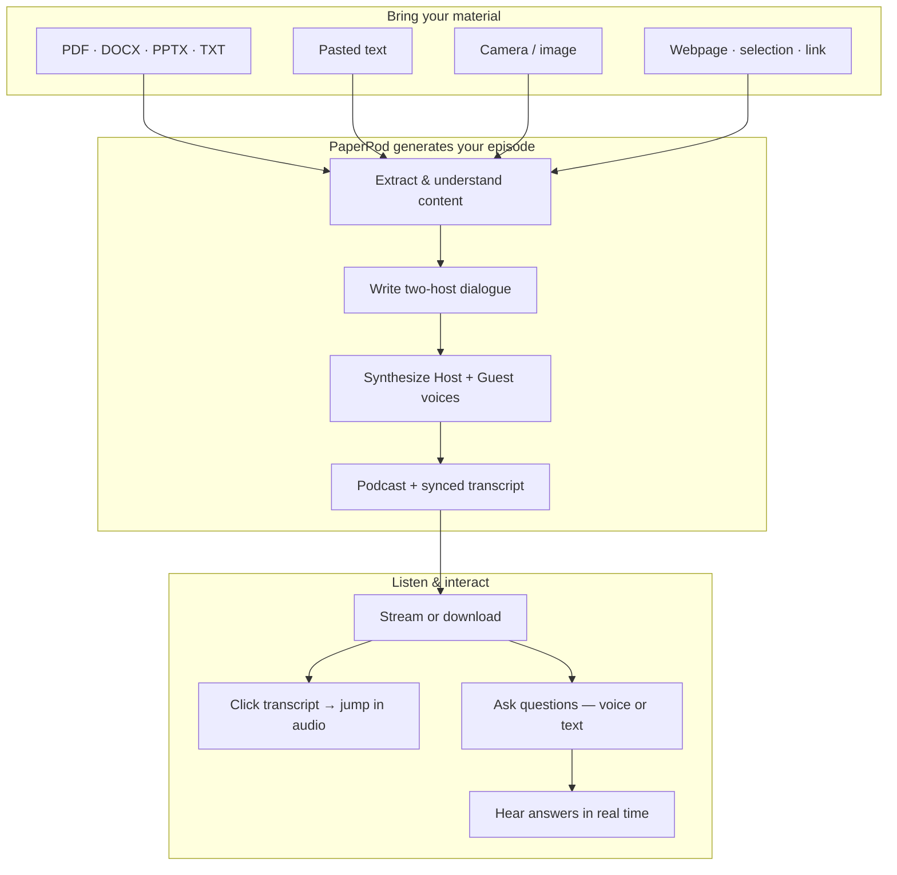
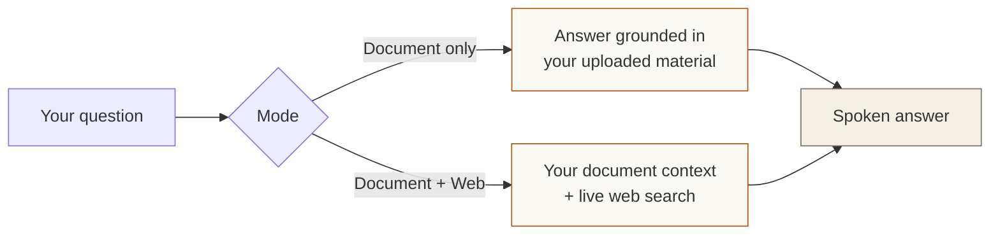
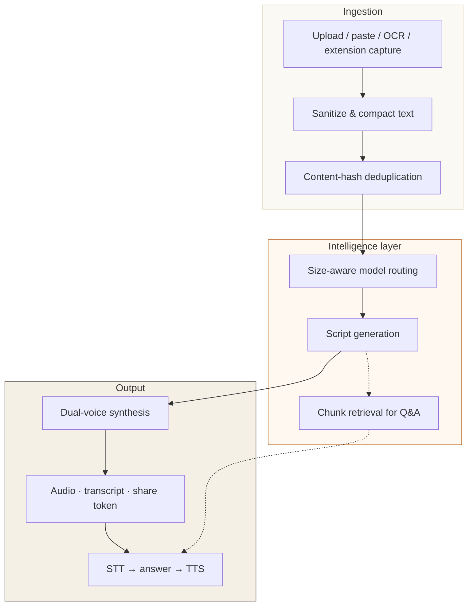

  <strong>PaperPod</strong>

  Turn any document into a listenable podcast — then talk back to it.

  <a href="https://paper-pod-one.vercel.app"><strong>Try PaperPod →</strong></a>
  &nbsp;·&nbsp;
  <a href="https://www.youtube.com/watch?v=3UU8Ikde_2M">Watch demo</a>
  &nbsp;·&nbsp;
  <a href="https://www.producthunt.com/products/paperpod-2">Product Hunt</a>

  <a href="https://chromewebstore.google.com/detail/paperpod-%E2%80%94-ai-podcast-for/oeppbenincbmdaomedjpjfegnfphdoeo">Chrome extension</a>
  &nbsp;·&nbsp;
  <a href="https://addons.mozilla.org/en-US/firefox/addon/paperpod-ai-podcast/">Firefox extension</a>

---

## What PaperPod does

PaperPod transforms static documents into **natural two-host podcast conversations** — the kind you'd actually want to listen to on a commute, at the gym, or while cooking.

Upload a PDF, DOCX, PPTX, or TXT. Paste notes. Snap a photo. Or send a webpage from the browser extension. PaperPod reads the material, writes a conversational script, voices it with two distinct hosts, and gives you a **synchronized transcript** you can click through while you listen.

When something isn't clear, **ask out loud or in text**. PaperPod answers from your document — or, in Document + Web mode, combines your upload with live web context.

No GPU. No editing timeline. No studio setup. Just drop a file and get an episode.

---

## Why it feels different

Most “document to audio” tools read your file aloud. PaperPod **explains** it — two hosts discuss the ideas, trade clarifications, and walk you through the material the way a great study partner would.

| | Typical text-to-speech | PaperPod |
|---|------------------------|----------|
| **Format** | Monotone read-through | Two-host dialogue |
| **Engagement** | Passive listening | Conversational, paced for comprehension |
| **Follow-up** | None | Real-time voice & text Q&A |
| **Visuals** | Ignored | PDF figures & image OCR where it matters |
| **Where you use it** | Upload only | Web app + Chrome & Firefox extensions |

---

## How it works

```mermaid
flowchart TB
    subgraph INPUT["Bring your material"]
        PDF["PDF · DOCX · PPTX · TXT"]
        PASTE["Pasted text"]
        CAM["Camera / image"]
        WEB["Webpage · selection · link"]
    end

    subgraph GENERATE["PaperPod generates your episode"]
        EXTRACT["Extract & understand content"]
        SCRIPT["Write two-host dialogue"]
        VOICE["Synthesize Host + Guest voices"]
        EPISODE["Podcast + synced transcript"]
    end

    subgraph LISTEN["Listen & interact"]
        PLAY["Stream or download"]
        SYNC["Click transcript → jump in audio"]
        ASK["Ask questions — voice or text"]
        ANSWER["Hear answers in real time"]
    end

    PDF --> EXTRACT
    PASTE --> EXTRACT
    CAM --> EXTRACT
    WEB --> EXTRACT
    EXTRACT --> SCRIPT --> VOICE --> EPISODE
    EPISODE --> PLAY --> SYNC
    PLAY --> ASK --> ANSWER
```

**Typical flow:** upload → ~2–3 minutes of processing → listen → ask follow-ups as you go.

---

## Product surface

PaperPod meets you where you already read.

**Web app** — [paper-pod-one.vercel.app](https://paper-pod-one.vercel.app)  
Drop a file, paste text, or upload from camera. Sign in to keep a personal library, share episodes, and download audio + transcripts.

**Browser extension** — [Chrome](https://chromewebstore.google.com/detail/paperpod-%E2%80%94-ai-podcast-for/oeppbenincbmdaomedjpjfegnfphdoeo) · [Firefox](https://addons.mozilla.org/en-US/firefox/addon/paperpod-ai-podcast/)  
Right-click any page, selection, image, or file link. PaperPod turns it into an episode without leaving your workflow.

**Shareable links** — Send a podcast to a friend. They can listen and explore the transcript without signing up.

---

## Q&A modes

```mermaid
flowchart LR
    Q["Your question"] --> MODE{Mode}

    MODE -->|Document only| DOC["Answer grounded in<br/>your uploaded material"]
    MODE -->|Document + Web| HYBRID["Your document context<br/>+ live web search"]

    DOC --> AUDIO["Spoken answer"]
    HYBRID --> AUDIO

    style DOC fill:#FBF9F4,stroke:#B45309
    style HYBRID fill:#FBF9F4,stroke:#B45309
    style AUDIO fill:#F5F0E6,stroke:#78716C
```

- **Document only** — Best for exams, internal reports, and proprietary notes. Answers stay inside what you uploaded.
- **Document + Web** — Best when you want definitions, recent context, or ideas that extend beyond the page.

Ask by **typing** or **speaking**; answers come back as audio you can play inline.

---

## Under the hood

PaperPod is a production pipeline, not a single prompt. Documents are extracted, routed by size and complexity, turned into length-calibrated dialogue, voiced in parallel, and quality-checked before delivery.

```mermaid
flowchart TB
    subgraph INGEST["Ingestion"]
        UP["Upload / paste / OCR / extension capture"]
        CLEAN["Sanitize & compact text"]
        DEDUP["Content-hash deduplication"]
    end

    subgraph INTELLIGENCE["Intelligence layer"]
        ROUTE["Size-aware model routing"]
        LLM["Script generation"]
        RETRIEVE["Chunk retrieval for Q&A"]
    end

    subgraph OUTPUT["Output"]
        TTS["Dual-voice synthesis"]
        QA["STT → answer → TTS"]
        STORE["Audio · transcript · share token"]
    end

    UP --> CLEAN --> DEDUP --> ROUTE --> LLM --> TTS --> STORE
    STORE --> QA
    LLM -.-> RETRIEVE
    RETRIEVE -.-> QA

    style INGEST fill:#FBF9F4,stroke:#E6DCC8
    style INTELLIGENCE fill:#FFF8F0,stroke:#B45309
    style OUTPUT fill:#F5F0E6,stroke:#78716C
```

Built for **reliability under real free-tier limits**: one primary LLM call per episode where possible, intelligent fallbacks for large documents, idempotent retries, and adaptive concurrency so generation stays fast without tripping provider rate limits.

---

## Built for real documents

- **PDF** — Text extraction plus optional vision pass for diagrams and figures
- **DOCX & PPTX** — Structured text, tables, and slide content
- **Plain text** — Paste anything
- **Images** — Camera upload with OCR
- **Web** — Full pages, selections, and linked files via extension

Episode length scales with document size — from a quick briefing to a deep ~20-minute listen.

---

## Privacy & trust

PaperPod is designed around **your content, your session**.

- Uploaded source files are not kept indefinitely after text is extracted (see [Privacy Policy](https://paper-pod-one.vercel.app/privacy.html)).
- Document-only Q&A never leaves your material.
- Sign-in is optional to try the product; an account unlocks your library and history.

---

## For engineers

The implementation details — LLM routing across Groq and Gemini, TPM-aware fallbacks, dedup semantics, adaptive TTS concurrency, and retrieval-augmented Q&A — are documented in long-form write-ups, not in this README:

- [Architecture deep dive (LinkedIn)](https://www.linkedin.com/pulse/building-production-grade-document-to-podcast-pipeline-pushkal-shukla-ebgjf)
- [Engineering blog (Medium)](https://medium.com/@pushkalshuk/building-a-production-grade-document-to-podcast-pipeline-lessons-from-llm-routing-concurrency-88a7b064c279)

Interested in integrations, partnerships, or enterprise use? Reach out via [Product Hunt](https://www.producthunt.com/products/paperpod-2) or the contact links on [paper-pod-one.vercel.app](https://paper-pod-one.vercel.app).

---

## Watch & learn

| | |
|---|---|
| [Founder intro](https://www.youtube.com/watch?v=G0jdx3Y9ZQE) | Why PaperPod exists |
| [Product demo](https://www.youtube.com/watch?v=3UU8Ikde_2M) | End-to-end walkthrough |
| [Feature deep dive](https://www.youtube.com/watch?v=KqSpaN2U7qM) | Transcript sync, Q&A modes, extension |

---

## License

This repository is open source under the [MIT License](LICENSE). PaperPod as a **hosted service** at [paper-pod-one.vercel.app](https://paper-pod-one.vercel.app) is the supported product experience — maintained, monitored, and updated continuously.

---

  Documents → Podcast → Conversation

